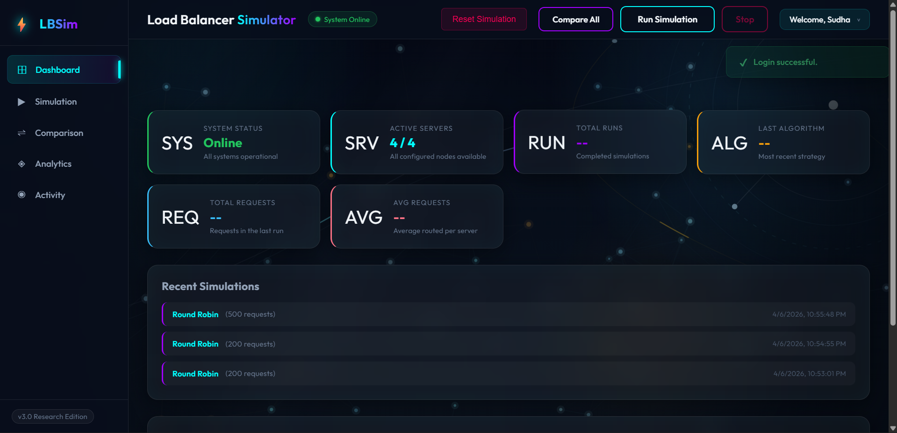
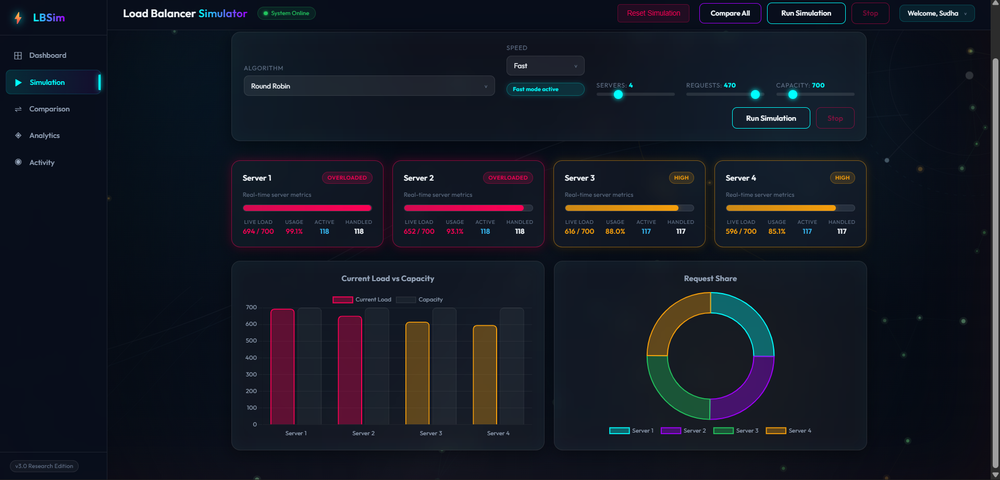
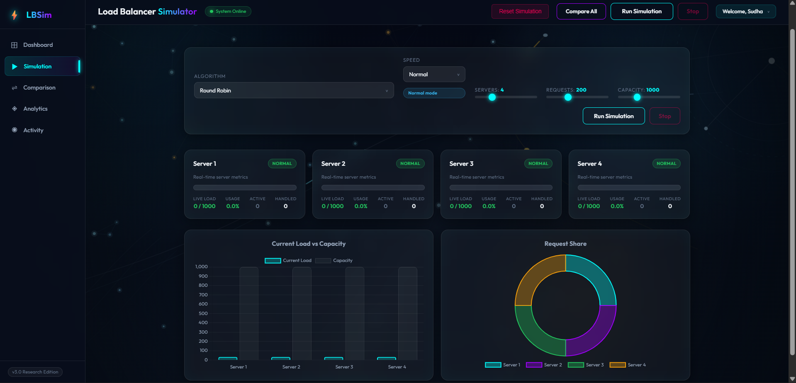
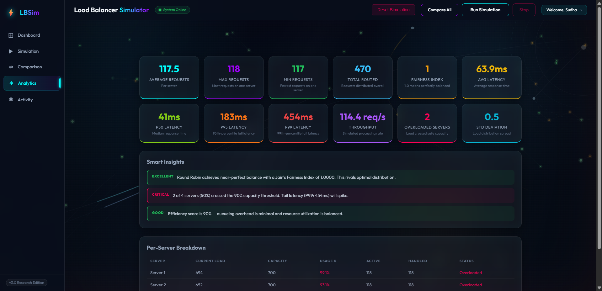
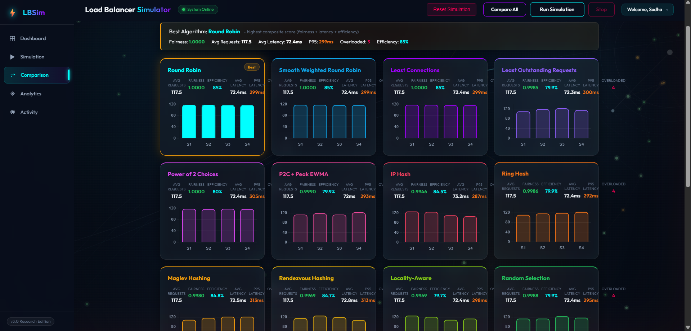
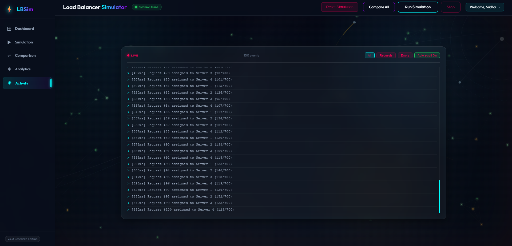
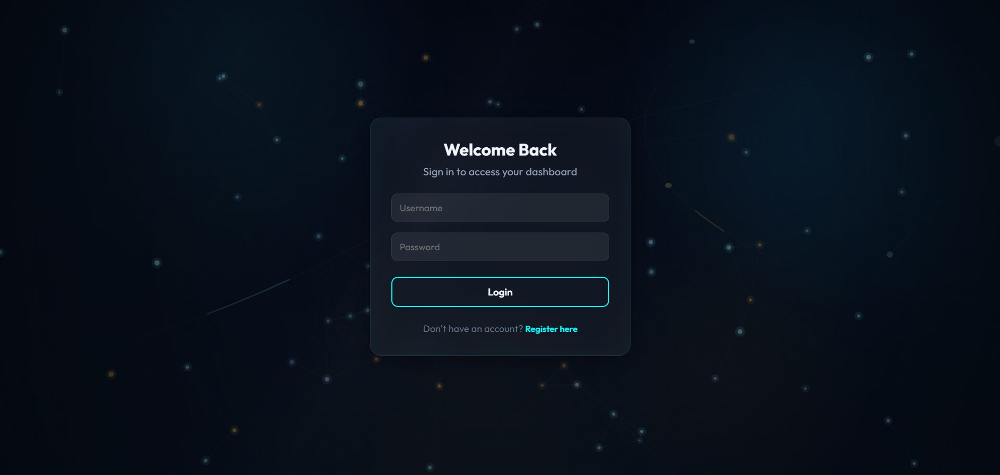

<div align="center">
  

  # ⚖️ Load Balancer Simulator

  <p>
    <strong>A modern full-stack dashboard to simulate, analyze, and compare load balancing strategies.</strong>
  </p>
  
  <p>
    <a href="http://loadbalancer-simulator-frontend-2026-ab.s3-website.ap-south-1.amazonaws.com/" target="_blank">
      
    </a>
  </p>
</div>

---

## ✨ Features
- **Algorithm Implementations:** Visually simulate Round Robin, Least Connections, Random, and Weighted load balancing methods.
- **Dynamic Simulation Events:** Generates realistic loads (100-500 requests) to mimic authentic traffic behaviors.
- **Glassmorphism Design Theme:** Premium, high-quality neon dashboard with smooth transitions and CSS keyframe animations.
- **Real-time Analytics:** Uses Chart.js for real-time visualization of server loads, request distribution, and performance metrics.
- **Overload Visual Alerts:** Dynamic threshold detection alerts you when active servers exceed safe operational capacity.
- **Secure Authentication:** JWT-based user authentication and data persistence with MongoDB.

---

## 📸 Screenshots & Previews

### 1. Main Dashboard


### 2. Live Simulation Metrics



### 3. Analytics & Comparisons
<p align="center">
  
  
</p>

### 4. User Activity & Authentication
<p align="center">
  
  
</p>

---

## 🛠️ Tech Stack
- **Frontend Core:** React.js, Vite, HTML5, CSS3 (Vanilla Glassmorphism UI)
- **Visualizations:** Chart.js
- **Backend Service:** Node.js, Express.js
- **Database & Storage:** MongoDB / Mongoose ODM

---

## 🚀 Getting Started (Step-by-Step Guide)

Welcome! If you are new to programming or just want an ultra-easy guide to getting this project running on your computer, you are in the exact right place. Follow these simple steps carefully, one by one!

### Step 1: Install the Required Tools (Prerequisites)
Before we can run the project, your computer needs a few basic tools installed. Think of these tools like the basic ingredients you need before baking a cake.
1. **Download Node.js:** 
   - Go to the official [Node.js website](https://nodejs.org/).
   - Click the big button that says **LTS (Long Term Support)** to download it.
   - Open the installer you just downloaded and simply click "Next" on all the default settings until it finishes.
2. **Download VS Code:**
   - Go to the [Visual Studio Code website](https://code.visualstudio.com/) and install it. This is a very popular and easy-to-use program that lets us view and run our code!

### Step 2: Get the Project Files
If your friend shared this code folder with you as a `.zip` file:
1. Right-click the `.zip` file and select **"Extract All..."**.
2. Choose where you want to save it (like your Desktop) and click **Extract**. Remember where this folder is!

### Step 3: Open the Project in VS Code
1. Open your newly installed **Visual Studio Code**.
2. At the top left of the screen, click on **File** -> **Open Folder...**
3. Find the `Load-Balancer-Simulator` folder (or `LOADBALANCER` folder) you just extracted, single-click it, and click **Select Folder** (or **Open**).

### Step 4: Start the Backend (The "Brain" of the App)
Now, we are going to start the hidden part of the app that does all the heavy computing.
1. In VS Code, go to the top menu and click **Terminal** -> **New Terminal**. A small text window will open at the bottom of your screen.
2. Copy the text below, paste it into that terminal, and press **Enter** on your keyboard:
   ```bash
   cd backend
   ```
3. Next, we need to download all the tiny pieces of code the brain needs. Paste this, press **Enter**, and wait a minute for it to finish:
   ```bash
   npm install
   ```
4. Once that finishes, it's time to turn it on! Paste this and press **Enter**:
   ```bash
   node server.js
   ```
   *🎉 Great job! You should see text saying the server is running on `http://localhost:5000`. Leave this terminal alone, do not close it!*

### Step 5: Start the Frontend (The "Face" of the App)
Now we will start the beautiful visual screen that you can actually click around and play with.
1. In VS Code's terminal window at the bottom, look for a small **"+" (plus)** icon on the right side. Click it to open a **second, brand new terminal screen**.
2. In this new terminal, copy the text below, paste it, and press **Enter**:
   ```bash
   cd frontend-react
   ```
3. Just like before, install the necessary code pieces. Paste this, press **Enter**, and wait a minute:
   ```bash
   npm install
   ```
4. Finally, start up the face of the app! Paste this and press **Enter**:
   ```bash
   npm run dev
   ```
   *🎉 Success! You should see some green text popup that says "VITE" and gives you a web link, usually `http://localhost:5173/`.*

### Step 6: Play with the Simulator!
1. Hover your computer mouse over the web link (like `http://localhost:5173/`) in your terminal.
2. Hold down the **Ctrl** key on your keyboard and **Left-Click** the link. (If you're on a Mac, use **Cmd + Click**). 
3. Your default web browser (like Google Chrome or Edge) will open, taking you straight to the beautiful Load Balancer Simulator dashboard!
4. Configure a server, select your favorite algorithm from the list, click **"Run Simulation"**, and watch the magic happen!

---

## 🔒 Security Best Practices
- The repository uses strict `.gitignore` rules to prevent pushing `loadbalancer-key.pem` and `.env` files to remote version control. Do not commit sensitive keys!

---

## 📜 Project Structure
```text
LOADBALANCER/
├── backend/
│   ├── controllers/    # Request dispatching & simulation logic
│   ├── models/         # Mongoose User and Request schemas
│   ├── routes/         # Express API endpoints
│   ├── middleware/     # JWT authentication verifiers
│   └── server.js       # Main API application 
├── frontend-react/
│   ├── src/            # React application components and views
│   ├── public/         # Static assets and template index
│   └── vite.config.js  # React development server options
├── .gitignore          # Repo-wide exclusion policies
└── README.md           # Documentation
```
